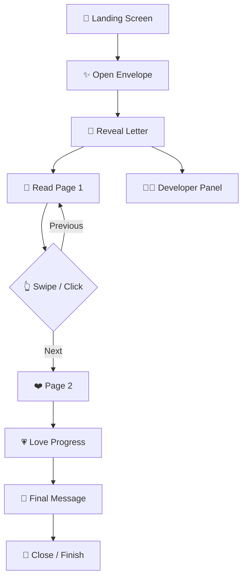

<div align="center">

<!-- ANIMATED HEADER -->


<br>

<p align="center">
  

</p>

# 🎨 VISUAL DESIGN
<div align="center">


<br><br>


</div>
<div align = "center'> 
<div align="center">

<a href="https://my-love-animatio-created-by-fahad.netlify.app/" target="_blank">


</a>

<br>

<a href="https://my-love-animatio-created-by-fahad.netlify.app/" target="_blank">


</div>
---

<div align="center">

# 💌 FOR YOUR LOVE

### *A digital love letter transformed into an interactive experience.*

<br>

> **"Some feelings are too deep for words...  
> so I wrote them in code."** ❤️

</div>

---

## 🌹 What Is This?

**For My Love** is not just a webpage.

It is an **interactive digital letter** designed to turn a traditional romantic message into a small visual experience.

The journey begins with an animated envelope.

Then...


```text
       💌
       │
       ▼
  OPEN THE LETTER
       │
       ▼
   ✨ REVEAL
       │
       ▼
  📖 READ THE STORY
       │
       ▼
  👆 SWIPE THROUGH
       │
       ▼
   ❤️ FEEL THE MOMENT
       │
       ▼
    💖 FOREVER
```

---
</div>  

<div align="center">

## ✨ EXPERIENCE

</div>

<table>
<tr>

<td width="50%" valign="top">

### 💌 Interactive Envelope

A CSS-designed envelope creates the first interaction.

✨ Opening animation  
💗 Envelope transformation  
🌹 Romantic visual effects  
🎬 Smooth transitions  

</td>

<td width="50%" valign="top">

### 📖 Digital Letter

The envelope transforms into an elegant letter interface.

📄 A4-style paper  
✍️ Typewriter effect  
📜 Multiple pages  
🔢 Page counter  

</td>

</tr>

<tr>

<td width="50%" valign="top">

### ❤️ Love Progress

A visual progress system follows the reader through the letter.

❤️ Animated progress  
💗 Heart indicator  
🌹 Page transitions  
✨ Dynamic state changes  

</td>

<td width="50%" valign="top">

### 🖱️ Interactive Effects

The website reacts to the user's interaction.

💕 Floating hearts  
🖱️ Cursor heart trail  
👆 Touch gestures  
⌨️ Keyboard controls  

</td>

</tr>
</table>

---

# 🎬 ANIMATED PREVIEW

<div align="center">

<!-- Replace this GIF with your own screen recording -->


<br>

### 💕 Open → Read → Swipe → Feel

</div>

> **Tip:** Replace the GIF above with a screen recording of your actual website for an even more impressive repository homepage.

---

# 💗 FEATURE SHOWCASE

<div align="center">

| 💌 | 📖 | ✨ | ❤️ |
|:---:|:---:|:---:|:---:|
| **Envelope** | **Letter** | **Animations** | **Progress** |
| Interactive | Multi-page | Typewriter | Love meter |

| 👆 | 🖱️ | 📱 | 👨‍💻 |
|:---:|:---:|:---:|:---:|
| **Swipe** | **Cursor Trail** | **Responsive** | **Developer** |
| Touch gestures | Heart particles | Mobile ready | Contact panel |

</div>

---


### 🎨 Design Language

```text
┌───────────────────────────────────────────┐
│                                           │
│        🌸 SOFT PINK                       │
│                 ↓                         │
│        🌹 ROMANTIC ROSE                   │
│                 ↓                         │
│        ❤️ DEEP CRIMSON                   │
│                 ↓                         │
│        🤍 PAPER WHITE                     │
│                 ↓                         │
│        💗 BLUSH GLOW                      │
│                                           │
└───────────────────────────────────────────┘
```

### ✨ Visual Techniques

- 🌈 CSS gradients
- 💎 Glassmorphism
- 🌫️ Backdrop blur
- 💗 Soft shadows
- ✨ CSS keyframe animations
- 📜 Paper texture
- ❤️ Floating particles
- 🖱️ Interactive cursor effects
- 📱 Responsive breakpoints

---

# 🧠 INTERACTION FLOW



---

# 📱 RESPONSIVE EXPERIENCE

The interface is designed to adapt between desktop and mobile screens.

<div align="center">

```text
┌─────────────────┐
│     DESKTOP     │
│                 │
│      💌         │
│   ┌─────────┐   │
│   │ LETTER  │   │
│   └─────────┘   │
│                 │
└─────────────────┘


        ↓


┌───────────────┐
│    MOBILE     │
│               │
│      💌       │
│   ┌───────┐   │
│   │LETTER │   │
│   └───────┘   │
│       ❤️      │
└───────────────┘
```

</div>

### Mobile Features

- 👆 Touch swipe
- 📱 Adaptive layout
- 🔘 Mobile developer button
- 🔤 Responsive typography
- 🖼️ Flexible letter sizing
- ⚡ Lightweight implementation

---

# 👨‍💻 DEVELOPER PANEL

A dedicated **CONTRACT WITH DEVELOPER** interface is included.

<div align="center">

### `CONTRACT WITH DEVELOPER`

**MD. FAHAD HOSSAIN**

Software Developer  
Web Developer  
Android Developer  
Cybersecurity

</div>

### 🔗 Social Connections

<div align="center">

[](https://www.facebook.com/share/1D7ExweqoM/)

[](https://www.instagram.com/mdfahadhossain006)

[](https://youtube.com/@brightnessworld)

[](https://github.com/MdFahadHossain006)

</div>

---

# 🛠️ TECH STACK

<div align="center">

### Frontend


### Tools & Platforms


</div>

---

# 📂 PROJECT STRUCTURE

```text
FOR-MY-LOVE/
│
├── 📄 index.html
│
├── 📸 screenshots/
│   ├── envelope.png
│   ├── letter.png
│   ├── mobile.png
│   └── developer-panel.png
│
└── 📘 README.md
```

> The core website is intentionally lightweight and can run directly from `index.html`.

---

# 🚀 RUN LOCALLY

### 01 — Clone

```bash
git clone https://github.com/MdFahadHossain006/for-my-love.git
```

### 02 — Enter

```bash
cd for-my-love
```

### 03 — Launch

Open:

```text
index.html
```

That's it.

No:

```text
❌ npm install
❌ build command
❌ framework
❌ backend
❌ database
```

Just:

```text
HTML + CSS + JavaScript ❤️
```

---

# 🌐 LIVE DEMO

<div align="center">

### 🔥 EXPERIENCE THE WEBSITE

<a href="https://love-animation-website-by-fahad.netlify.app/">


</a>

<br><br>

**Open the envelope.  
Read the letter.  
Feel the story. ❤️**

</div>

---

# 📸 SCREENSHOTS

<div align="center">

### 💌 Envelope


<br><br>

### 📖 Letter


<br><br>

### 👨‍💻 Developer Panel


</div>

---

# ♿ ACCESSIBILITY

The interactive developer panel includes accessibility-focused behavior.

```text
aria-haspopup
      ↓
aria-expanded
      ↓
aria-controls
      ↓
aria-modal
      ↓
Keyboard Navigation
      ↓
Escape to Close
      ↓
Focus Restoration
```

The interface also considers reduced-motion preferences for supported animations.

---

# ⚡ PERFORMANCE PHILOSOPHY

This project intentionally avoids unnecessary frameworks.

### Why?

```text
Vanilla JavaScript
       +
Modern CSS
       +
Semantic HTML
       ↓
Lightweight Experience
```

The result is a small project that can be hosted easily on static hosting platforms.

---

# 🔮 FUTURE IDEAS

```text
🎵 Background Music
        │
        ▼
🎙️ Voice Narration
        │
        ▼
📸 Memory Gallery
        │
        ▼
🔐 Private Letters
        │
        ▼
🌍 Multi-language
        │
        ▼
📤 Shareable Letters
        │
        ▼
📱 Progressive Web App
```

Possible future additions:

- 🎵 Romantic background music
- 🎙️ Voice narration
- 📸 Photo memories
- 🎆 Celebration animation
- 🔐 Password-protected letters
- 🌍 Multiple languages
- 💾 Personalized letters
- 🔗 Shareable personalized URLs
- 📱 PWA support
- 🖨️ Printable letter mode

---

# ❤️ MADE WITH LOVE

<div align="center">


<br><br>

### 👨‍💻 MD. FAHAD HOSSAIN

**Software Developer • Web Developer • Android Developer • Cybersecurity**

<br>

[](https://github.com/MdFahadHossain006)

<br><br>

> ### 💌 "Every line of code carries a little emotion."

<br>

⭐ **If you enjoyed this project, consider starring the repository.**

</div>

---

<div align="center">


</div>
